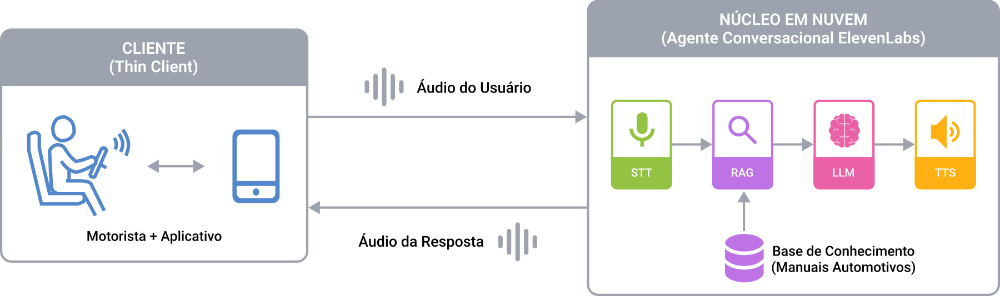
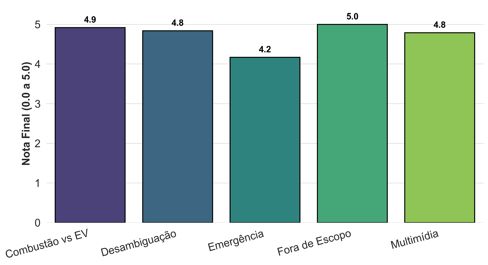
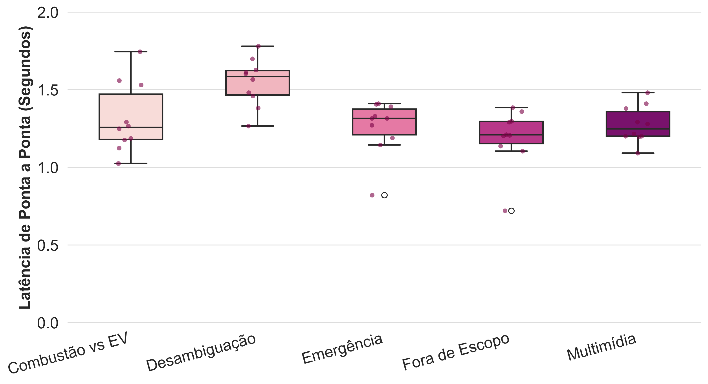

&nbsp;
&nbsp;
<p align="center">
  
</p>

&nbsp;

# Automação Inteligente Veicular com Edge–Cloud AI: Um Assistente Técnico Baseado em RAG e Interação por Voz


### Autores: [Maria Luz](https://github.com/marialluz), [Alice Freire](https://github.com/alicefvictorino), [Marianne Silva](https://github.com/MarianneDiniz) e [Ivanovitch Silva](https://github.com/ivanovitchm)


## Resumo

Assistentes conversacionais por voz têm ampliado sua presença no contexto automotivo, porém ainda permanecem restritos a funções de navegação, mídia e conveniência, oferecendo suporte limitado para consultas técnicas sobre o veículo. Nesse cenário, a busca manual por informações em manuais do proprietário torna-se pouco prática e distrativa durante a condução. Este trabalho propõe uma abordagem de assistência vocal automotiva orientada à consulta documental contextualizada, integrando interação *voice-to-voice*, recuperação documental via *Retrieval-Augmented Generation* e processamento cognitivo em nuvem. A solução foi operacionalizada por meio de um agente conversacional hospedado na plataforma *ElevenLabs* e acessado por aplicativo móvel em arquitetura *thin client*. Para avaliar sua viabilidade, conduziu-se um estudo de caso com cinquenta perguntas distribuídas em cinco blocos temáticos, utilizando manuais de dez veículos da frota Renault. Os resultados indicaram média qualitativa de **4,74** em *LLM-as-a-Judge* e latência média de **1,32 s**, evidenciando respostas tecnicamente consistentes e interação de baixa fricção. Conclui-se que a abordagem mostrou-se promissora para assistência vocal automotiva baseada em documentação técnica, embora consultas de emergência ainda demandem mecanismos adicionais de validação.


## Abordagem Proposta

A solução adota uma arquitetura **thin client**: o aplicativo móvel atua apenas como terminal de captura de áudio, reprodução da resposta sintetizada e gerenciamento da sessão conversacional. Todo o processamento intensivo — reconhecimento de fala, recuperação documental, inferência linguística e síntese vocal — é executado remotamente na infraestrutura da plataforma **ElevenLabs Conversational AI**. Não há *backend* de aplicação próprio.

<p align="center">
  
</p>

O *pipeline* organiza-se em quatro módulos interdependentes:

1. **Base de conhecimento documental** — os manuais do proprietário dos 10 veículos Renault e o manual do sistema multimídia são previamente carregados na base de conhecimento do agente na plataforma *ElevenLabs*.
2. **Reconhecimento de fala (STT)** — converte o áudio do usuário em texto.
3. **Núcleo cognitivo (RAG + LLM)** — a consulta textual é submetida à recuperação contextual sobre os manuais; trechos semanticamente relevantes são concatenados como contexto para o modelo de linguagem.
4. **Síntese de fala (TTS)** — converte a resposta textual em áudio contínuo, fechando o ciclo conversacional *voice-to-voice*.

### Especialização conversacional

O agente é regido por um *prompt* de sistema em português brasileiro que:

- Restringe o domínio das respostas à frota Renault suportada e aos sistemas multimídia correspondentes.
- Aplica políticas de **desambiguação** para linhas de veículo com nomes compartilhados entre versões (e.g., *Kwid* e *Kwid E-Tech*) — o agente solicita confirmação antes de emitir a instrução técnica.
- Define regras explícitas de ***fallback*** quando não há evidência documental disponível.
- Implementa mecanismos de contenção de alucinação, impedindo respostas não sustentadas pelo conteúdo recuperado.

### Escopo da frota (10 modelos Renault + manual multimídia)

| Motorização  | Modelos                                   |
|--------------|-------------------------------------------|
| Combustão    | Kwid, Logan, Oroch, Duster, Kardian       |
| Elétrico     | Kwid E-Tech, Zoe, Kangoo, Megane          |
| Híbrido      | Boreal                                    |

### Processo de engenharia

A implementação foi conduzida sob desenvolvimento assistido por inteligência artificial, alinhado à metodologia **[Spec-Kit](https://github.com/github/spec-kit)**. Nessa abordagem, requisitos funcionais, contratos de integração, políticas de observabilidade e critérios de tratamento de falhas são previamente formalizados em artefatos de especificação, antes da etapa de implementação. Os artefatos de Spec-Kit deste projeto encontram-se em `specs/002-voice-assistant/`.


## Estrutura do Repositório

```text
CBA2026/
├── lib/                         # Código-fonte Flutter / Dart
│   ├── main.dart                # Ponto de entrada do aplicativo
│   ├── app.dart                 # Widget raiz
│   ├── config/                  # Agent ID do ElevenLabs e variáveis de ambiente
│   ├── models/                  # CallSession, ConversationTurn e enums
│   ├── database/                # Tabelas e banco Drift (SQLite)
│   ├── services/                # Wrapper do cliente ElevenLabs, transcrição, logger
│   ├── providers/               # Riverpod providers para estado de chamada e transcrição
│   ├── screens/                 # Telas Home, Call, Transcript
│   ├── widgets/                 # Botão de chamada, indicador de status, hang-up etc.
│   └── l10n/                    # Strings de UI em português brasileiro
├── test/
│   ├── unit/                    # Testes de serviços e lógica
│   ├── widget/                  # Testes de tela
│   └── integration/             # Testes do ciclo de vida da sessão de chamada
├── ios/                         # Projeto da plataforma iOS
├── assets/
│   ├── images/                  # Logo e diagrama do pipeline
│   ├── manuais/                 # 10 manuais Renault + manual multimídia (PDF)
│   └── avaliacao/               # Benchmark, resultados LLM-as-a-Judge, gráficos, notebook
├── specs/
│   └── 002-voice-assistant/     # Spec, plan, tasks, contracts, data-model
├── .specify/                    # Governança Spec-Kit (constitution, templates)
├── pubspec.yaml                 # Dependências Flutter / Dart
├── analysis_options.yaml        # Configuração de lint
└── README.md
```


## Configuração do Ambiente

### Pré-requisitos

- **Flutter SDK** (canal stable mais recente) e **Dart SDK** (incluso com o Flutter)
- **Xcode 15+** para builds iOS (apenas macOS)
- **Android Studio** ou Android SDK (API 26+) para builds Android
- Um **dispositivo físico** para testes — simuladores têm suporte limitado ao microfone
- Uma conta **ElevenLabs** com um Conversational AI Agent configurado (o *agent ID* é obrigatório no build)

### 1. Clonar o repositório

```bash
git clone https://github.com/marialluz/CBA2026.git
cd CBA2026
```

### 2. Configurar o Agent ID do ElevenLabs

Crie o arquivo `lib/config/env.dart` com:

```dart
const String elevenLabsAgentId = 'SEU_AGENT_ID_AQUI';
```

### 3. iOS — adicionar a descrição de uso do microfone

Adicione ao `ios/Runner/Info.plist`:

```xml
<key>NSMicrophoneUsageDescription</key>
<string>O aplicativo precisa de acesso ao microfone para conversar com o assistente de voz da Renault.</string>
```

### 4. Android — verificar as permissões necessárias

Em `android/app/src/main/AndroidManifest.xml`:

```xml
<uses-permission android:name="android.permission.RECORD_AUDIO"/>
<uses-permission android:name="android.permission.INTERNET"/>
<uses-permission android:name="android.permission.MODIFY_AUDIO_SETTINGS"/>
```

### 5. Instalar dependências e executar

```bash
flutter pub get
flutter run                     # Executa em dispositivo conectado
```


## Principais Comandos

```bash
flutter pub get                 # Instala dependências
flutter run                     # Build de desenvolvimento em dispositivo conectado
flutter test                    # Executa testes unitários, de widget e de integração
flutter analyze                 # Análise estática (lint)
flutter build ipa               # Build de release para iOS
flutter build apk               # Build de release para Android
```


## Avaliação

A abordagem proposta foi avaliada em um *benchmark* de **50 perguntas** organizadas em **5 blocos temáticos** (10 perguntas cada), utilizando os manuais de 10 veículos Renault. Foram consideradas duas métricas: **qualidade textual** (*LLM-as-a-Judge*, escala Likert de 0 a 5) e **latência ponta a ponta** *voice-to-voice*.

### Estrutura do benchmark

| Bloco                              | n  | Exemplo                                                          |
|------------------------------------|----|------------------------------------------------------------------|
| Desambiguação de frota             | 10 | "Como eu ligo o ar-condicionado do Kwid?"                        |
| Combustão *vs.* elétrico           | 10 | "Quanto tempo demora uma carga completa no Megane E-Tech?"       |
| Emergência e segurança             | 10 | "Acendeu uma luz vermelha com desenho de óleo no Logan, ..."     |
| Multimídia e bordo                 | 10 | "Como eu conecto meu celular no Bluetooth do sistema multimídia?"|
| Fora de escopo / alucinação        | 10 | "Como eu faço para carregar meu BYD Dolphin Mini?"               |

### Resultados

| Bloco                              | Nota média | Latência média (s) |
|------------------------------------|------------|--------------------|
| Fora de escopo / alucinação        | **5,00**   | **1,19**           |
| Combustão *vs.* elétrico           | 4,92       | 1,32               |
| Desambiguação de frota             | 4,84       | 1,55               |
| Multimídia                         | 4,79       | 1,28               |
| Emergência                         | 4,17       | 1,26               |
| **Média global (n = 50)**          | **4,74**   | **1,32**           |

<p align="center">
  
  &nbsp;&nbsp;
  
</p>

Os melhores desempenhos concentraram-se em blocos nos quais o agente precisou solicitar confirmação complementar ou restringir explicitamente o domínio de resposta (*Desambiguação* e *Fora de Escopo*), validando a efetividade das políticas conversacionais definidas no *prompt* de sistema. A maior sensibilidade qualitativa foi observada no bloco **Emergência**, em que pequenas omissões tornam-se proporcionalmente mais críticas sob a ótica de segurança operacional.

### Reproduzindo a avaliação

Os notebooks e dados brutos da avaliação estão em `assets/avaliacao/`:

- `assets/avaliacao/avaliacao_assistente_voz_Renault.ipynb` — *pipeline* de pontuação *LLM-as-a-Judge*
- `assets/avaliacao/graficos.ipynb` — geração dos gráficos de resultados
- `assets/avaliacao/benchmark.txt` — lista completa das 50 perguntas do *benchmark*
- `assets/avaliacao/coleta-cba2026.csv` — respostas brutas e metadados por pergunta
- `assets/avaliacao/Resultados_Finais_CBA_Avaliados.csv` — base final pontuada


## Principais Documentos e Bases de Dados

| Arquivo                                                | Descrição                                            |
|--------------------------------------------------------|------------------------------------------------------|
| `assets/manuais/manual-{kwid,logan,oroch,duster,kardian,zoe-eletrico,kangoo-eletrico,kwid-eletrico,megane-eletrico,boreal}.pdf` | Manuais do proprietário Renault (10 modelos) |
| `assets/manuais/manual-multimidia.pdf`                 | Manual do sistema multimídia Renault                 |
| `assets/avaliacao/benchmark.txt`                       | *Benchmark* de 50 perguntas em 5 blocos temáticos    |
| `assets/avaliacao/Resultados_Finais_CBA_Avaliados.csv` | Resultados finais pontuados pelo *LLM-as-a-Judge*    |
| `specs/002-voice-assistant/`                           | Artefatos Spec-Kit (spec, plan, tasks, contracts)    |


## Agradecimentos

Esta pesquisa foi conduzida na **Universidade Federal do Rio Grande do Norte (UFRN)** como parte das atividades do grupo de pesquisa Conect2AI.


## Sobre Nós

O grupo de pesquisa **Conect2AI** é composto por estudantes de graduação e pós-graduação da **Universidade Federal do Rio Grande do Norte (UFRN)**. O grupo dedica-se à aplicação de Inteligência Artificial e Aprendizado de Máquina em áreas emergentes como **Inteligência Embarcada, Internet das Coisas e Sistemas de Transporte Inteligentes**, contribuindo para soluções de eficiência energética e mobilidade sustentável.

Site: http://conect2ai.dca.ufrn.br
